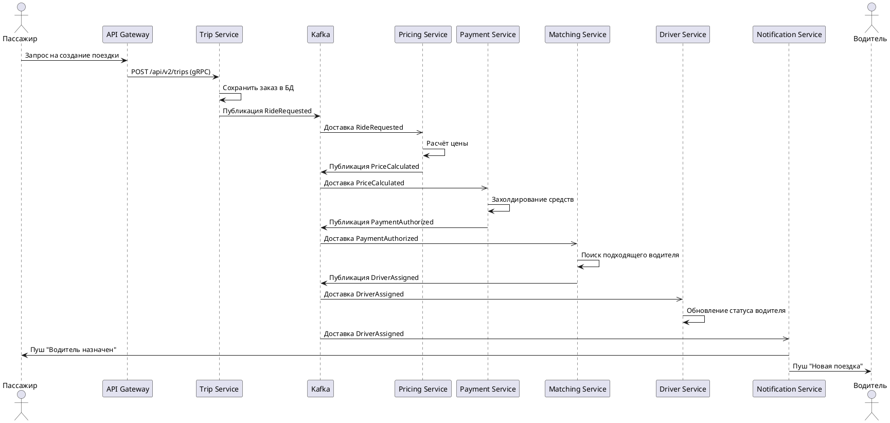
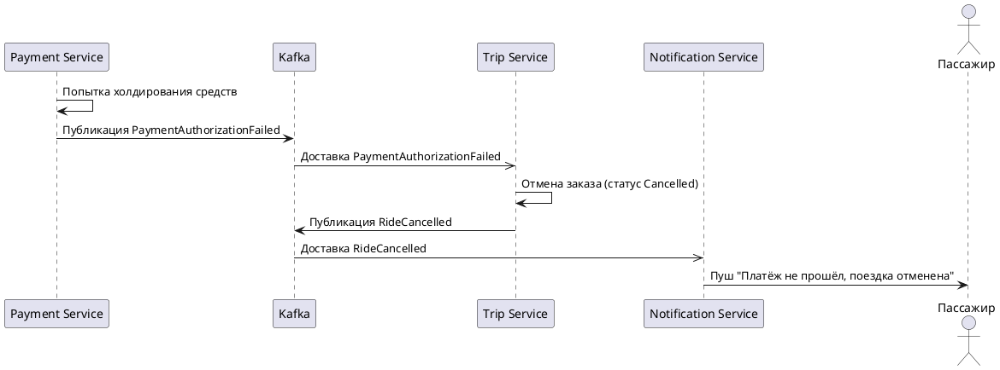

# ADR-002: Проектирование Event-Driven архитектуры GoFuture

**Статус:** ⚠️ На рассмотрении  
**Участники:** Глушенко Сергей  
**Дата:** 2026-04-25

---

## 1. Контекст

Бизнес-требования обработки 500 тысяч конкурентных поездок, динамического ценообразования в реальном времени, умного распределения водителей и глобального масштабирования в нескольких регионах диктуют необходимость перехода к событийно-ориентированной архитектуре.  
Монолитная реализация не может обеспечить низкую задержку, эластичность и геораспределённость.  
В результате предыдущей архитектурной работы (ADR-001) была принята целевая микросервисная архитектура с центральной шиной событий Apache Kafka и независимыми доменными сервисами.  
Настоящий ADR детализирует проектирование самой событийной платформы: модель событий, топологию топиков, механизмы надёжной доставки, выбор типа Saga и инструменты мониторинга.

## 2. Требования

- Обработка более 500 тыс. конкурентных поездок в реальном времени.
- Горизонтальное масштабирование событийной шины в нескольких географических регионах.
- Надёжная доставка событий с гарантией at-least-once для критических бизнес-событий.
- Соблюдение порядка событий в рамках одного бизнес-контекста (например, заказ).
- Возможность масштабирования и независимого развёртывания консьюмеров.
- Интеграция с приложениями основных доменов и аналитическими движками (Flink, Spark).
- Полная наблюдаемость: сквозная трассировка, метрики производительности, лаги консьюмеров, алерты.
- Соответствие локальным регуляторным требованиям по хранению и обработке данных.

## 3. Решение

### 3.1 Модель доменных событий

Все значимые действия в системе оформляются как факты (Events), имеющие неизменяемую структуру и уникальный идентификатор. Каждое событие содержит:

- `eventId`, `eventType`, `timestamp`, `source`, `correlationId` (ID поездки/заказа), `payload`.

Ключевые семейства событий:

| Группа            | События                                                                          |
| ----------------- | -------------------------------------------------------------------------------- |
| Поездка           | `RideRequested`, `RideAccepted`, `RideStarted`, `RideCompleted`, `RideCancelled` |
| Водитель          | `DriverLocationUpdated`, `DriverAvailable`, `DriverBusy`, `DriverOffline`        |
| Ценообразование   | `PriceCalculated`, `SurgeFactorChanged`                                          |
| Платежи и выплаты | `PaymentAuthorized`, `PaymentCaptured`, `PayoutRequested`, `PayoutCompleted`     |
| Уведомления       | `NotificationSent`, `NotificationFailed`                                         |
| Сага‑компенсации  | `BookingCompensationInitiated`, `PaymentRefunded`, `DriverReleased`              |

### 3.2 Схема топиков Kafka и партиционирование

Топики разделены по доменам. Для обеспечения локальности данных и соблюдения порядка в рамках региона используется **составной ключ**: `region_code:business_entity_id`. Партиционирование – по хешу этого ключа.

```text
ride-events                # ключ: region:rideId
driver-location-updates    # ключ: region:driverId (компактированный топик)
pricing-events             # ключ: region:cityId (для суржей)
payment-events             # ключ: region:paymentId
notification-events        # ключ: region:notificationId
saga-commands              # команды саги (ключ: region:sagaId)
saga-responses             # ответы/компенсации (ключ: region:sagaId)
analytics-stream           # поток для аналитики
```

*Обоснование:* Партиционирование по региону гарантирует, что все события одного заказа (привязанного к региону) попадают в одну партицию, сохраняя порядок. Это упрощает обработку в консьюмерах и соблюдение требований GDPR / локального законодательства.

### 3.3 Потребители событий (Stream Processing)

Для обработки в реальном времени используются:

- **Kafka Streams (KStreams)** – встраивается в микросервисы, требующие stateful-обработки с низкой задержкой: Matching & Dispatch, Fraud Detection, Dynamic Pricing.
- **Apache Flink** – для сложной аналитической обработки и машинного обучения (прогнозирование спроса, подсчёт горячих зон, многооконные агрегации). Потребители Flink читают из топика `analytics-stream` и пишут результаты в ClickHouse.

Каждый микросервис подписывается только на необходимые топики и использует локальное состояние (RocksDB в KStreams) для операций join/aggregate, что исключает дорогие запросы к внешним БД.

### 3.4 Выбор типа Saga и её реализация

Для распределённых транзакций, охватывающих несколько сервисов (например, создание поездки включает проверку пассажира, цены, захолдирование платежа и назначение водителя), применена **Saga на основе хореографии (Choreography-based Saga)**.

*Аргументы выбора хореографии:*  

- Уменьшает связанность сервисов (нет единого оркестратора).  
- Естественно ложится на событийную шину – каждый шаг генерирует событие, на которое реагируют следующие участники.  
- Повышает отказоустойчивость и упрощает расширение новыми шагами.

Каждый сервис при получении события выполняет свою часть работы и публикует следующее событие. В случае сбоя публикуется событие отказа, инициирующее компенсационные действия.

**Таблица-реестр событий Saga-хореографии для сценария «Создание поездки»**

| Этап                                | Тип события  | Название события             | Описание                                                  |
| ----------------------------------- | ------------ | ---------------------------- | --------------------------------------------------------- |
| Инициация поездки                   | domain       | `RideRequested`              | Пассажир создал запрос на поездку.                        |
| Расчёт цены успешен                 | domain       | `PriceCalculated`            | Цена поездки рассчитана и зафиксирована.                  |
| Ошибка расчёта цены                 | failure      | `PriceCalculationFailed`     | Не удалось рассчитать цену (нет тарифов, ошибка).         |
| Платёж зарезервирован               | domain       | `PaymentAuthorized`          | Средства на карте пассажира зарезервированы.              |
| Ошибка резервирования               | failure      | `PaymentAuthorizationFailed` | Платёж не прошёл (недостаточно средств, блокировка).      |
| Найден подходящий водитель          | domain       | `DriverAssigned`             | Водитель выбран и получил предложение.                    |
| Водитель подтвердил                 | domain       | `DriverAccepted`             | Водитель принял заказ.                                    |
| Компенсация – освобождение водителя | compensation | `DriverReleased`             | Водитель освобождён, если заказ отменён после назначения. |
| Компенсация – возврат платежа       | compensation | `PaymentRefunded`            | Зарезервированы е средства возвращены пассажиру.          |
| Отмена поездки                      | compensation | `RideCancelled`              | Финальное событие отмены (для уведомлений, аналитики).    |

**Основной поток создания поездки**



**Описание шагов основного потока:**

1. Пассажир отправляет запрос на создание поездки через API Gateway.
2. Trip Service сохраняет заказ в своей базе и публикует событие `RideRequested` в Kafka.
3. Pricing Service получает событие, рассчитывает стоимость и публикует `PriceCalculated`.
4. Payment Service, получив `PriceCalculated`, зарезервирует средства и публикует `PaymentAuthorized`.
5. Matching Service реагирует на `PaymentAuthorized`, подбирает наиболее подходящего водителя и публикует `DriverAssigned`.
6. Driver Service обновляет статус водителя, а Notification Service рассылает push-уведомления пассажиру и водителю.

Все взаимодействия асинхронны, что гарантирует отсутствие блокировок и высокую пропускную способность.

**Поток с ошибкой (платёж не прошёл)**



**Описание шагов при ошибке платежа:**

1. Payment Service не может зарезервировать средства (недостаточно средств, карта заблокирована и т. п.) и публикует событие `PaymentAuthorizationFailed`.
2. Trip Service, подписанный на это failure-событие, отменяет заказ в своём состоянии и публикует компенсационное событие `RideCancelled`.
3. Notification Service доставляет уведомление пассажиру об отмене.

Поскольку в этом сценарии водитель ещё не был назначен, дополнительные компенсации (освобождение водителя, возврат платежа) не требуются. Если бы ошибка произошла после назначения водителя, Matching Service инициировал бы публикацию `DriverReleased`, а Payment Service — `PaymentRefunded`.

### 3.5 Механизмы надёжной доставки

- **Гарантия at-least-once** для бизнес-событий: продюсеры используют `acks=all` и `retries`, консьюмеры фиксируют смещения после обработки (enable.auto.commit=false).
- **Идемпотентность продюсеров** (`enable.idempotence=true`) для предотвращения дубликатов.
- **Идемпотентность консьюмеров** реализуется на уровне бизнес-логики: проверка уникальности `eventId` или `correlationId`.
- **Dead Letter Queue (DLQ):** сообщения, которые не удалось обработать после N попыток, направляются в специальный топик для ручного разбора.
- **Транзакционная запись:** в критических участках (например, публикация `PaymentAuthorized` и обновление состояния в БД) используется Kafka Transactions (exactly-once semantics) для координации записи в несколько топиков.

### 3.6 Мониторинг и метрики событийной платформы

**Подход к мониторингу:**  
Мониторинг событийной платформы базируется на трёх столпах: метрики (Prometheus), логи (Loki) и распределённая трассировка (Jaeger).  
Особое внимание уделяется «чёрному ящику» бизнес-потоков: для каждого этапа Saga отслеживается время прохождения и количество ошибок.  
Используется централизованный Schema Registry, что позволяет контролировать нарушения контрактов на уровне продюсеров.  
Оповещения настроены на критические отклонения: резкое падение throughput, рост лага консьюмеров, увеличение доли failure-событий, недоступность брокеров.

**Список ключевых метрик:**

| Категория              | Метрика                                                                   | Описание                                                 |
| ---------------------- | ------------------------------------------------------------------------- | -------------------------------------------------------- |
| Пропускная способность | `kafka_producer_bytes_out_total` / `kafka_consumer_bytes_in_total`        | Объём трафика по топикам                                 |
| Пропускная способность | `kafka_messages_in_per_sec` / `kafka_bytes_in_per_sec`                    | Количество сообщений и байт в секунду                    |
| Лаг консьюмеров        | `kafka_consumer_lag` (max / avg по группе)                                | Отставание обработки от продюсера                        |
| Задержка обработки     | `event_processing_latency_seconds` (кастомная метрика в приложениях)      | Время от получения события до завершения бизнес-операции |
| Ошибки                 | `kafka_producer_record_error_total` / `kafka_consumer_record_error_total` | Ошибки сериализации/десериализации, фатальные исключения |
| Ошибки компенсаций     | `saga_compensation_triggered_total`                                       | Количество запущенных компенсационных сценариев          |
| Состояние партиций     | `kafka_partition_under_replicated`, `kafka_partition_offline`             | Проблемы репликации, доступности партиций                |
| Бизнес-метрики         | `saga_step_duration_seconds` (histogram по шагам)                         | Время выполнения каждого шага Saga                       |

**Интеграция в архитектуру To‑Be:**  
Метрики собираются Prometheus (через Kafka Exporter, JMX Exporter для брокеров, микрометр в KStreams/Flink). Jaeger получает трейсы из заголовков сообщений (Kafka Headers).  
Конфигурация алертов хранится в Alertmanager, дашборды создаются в Grafana (включая специализированные Kafka-дашборды).

### 3.7 Диаграмма C2 событийной платформы

```plantuml
@startuml
!include https://raw.githubusercontent.com/plantuml-stdlib/C4-PlantUML/master/C4_Container.puml

Person(passenger, "Пассажир", "Инициирует поездку")
Person(driver, "Водитель", "Взаимодействует с системой")

System_Boundary(go_future_platform, "GoFuture Platform v2.0 – Событийная архитектура") {
    Container(api_gateway, "API Gateway", "Kong", "Маршрутизация, аутентификация")

    System_Boundary(kafka_platform, "Event Streaming Platform") {
        ContainerQueue(kafka, "Event Bus", "Apache Kafka", "Центральная шина событий")
        Container(schema_registry, "Schema Registry", "Confluent SR", "Управление схемами событий")
    }

    System_Boundary(stream_processors, "Stream Processors") {
        Container(kstreams_apps, "KStreams Apps", "Java/Kotlin", "Stateful обработка: Matching, Fraud, Pricing")
        Container(flink_cluster, "Flink Cluster", "Java/Scala", "Сложная аналитика, ML в реальном времени")
    }

    System_Boundary(services, "Domain Services") {
        Container(trip_svc, "Trip Service", "Go", "Инициирует RideRequested, обрабатывает завершение")
        Container(pricing_svc, "Pricing Service", "Rust", "Реагирует на RideRequested, публикует PriceCalculated")
        Container(payment_svc, "Payment Service", "Kotlin", "Обрабатывает холдирование и захват платежей")
        Container(matching_svc, "Matching & Dispatch", "Rust", "Назначает водителя, публикует DriverAssigned")
        Container(driver_svc, "Driver Service", "Go", "Управляет состоянием водителя")
        Container(notification_svc, "Notification Service", "Go", "Рассылает уведомления")
    }

    System_Boundary(monitoring, "Мониторинг и Observability") {
        Container(prometheus, "Prometheus", "TSDB", "Сбор метрик со всех компонентов")
        Container(grafana, "Grafana", "Dashboards", "Визуализация метрик и бизнес-дашборды")
        Container(jaeger, "Jaeger", "Tracing", "Распределённая трассировка событий")
        Container(alertmanager, "Alertmanager", "Alerting", "Управление оповещениями")
        Container(kafka_exporter, "Kafka Exporter", "Exporter", "Метрики Kafka для Prometheus")
    }
}

System_Ext(bank_api, "API Банка", "Проведение платежей")

' Связи пользователей
Rel(passenger, api_gateway, "HTTP запрос на поездку")
Rel(driver, api_gateway, "Обновление локации, статус")

' Публикация событий продюсерами
Rel(api_gateway, trip_svc, "транслирует запрос", "gRPC")
Rel(trip_svc, kafka, "RideRequested, RideCancelled")
Rel(pricing_svc, kafka, "PriceCalculated, PriceCalculationFailed")
Rel(payment_svc, kafka, "PaymentAuthorized, PaymentRefunded")
Rel(matching_svc, kafka, "DriverAssigned, DriverReleased")
Rel(driver_svc, kafka, "DriverAccepted, DriverLocationUpdated")
Rel(notification_svc, kafka, "NotificationSent")

' Чтение событий консьюмерами (основные подписки)
Rel(kafka, pricing_svc, "подписка на RideRequested")
Rel(kafka, payment_svc, "подписка на PriceCalculated")
Rel(kafka, matching_svc, "подписка на PriceCalculated и PaymentAuthorized")
Rel(kafka, driver_svc, "подписка на DriverAssigned")
Rel(kafka, notification_svc, "подписка на DriverAssigned, RideStarted, RideCompleted")

' Stream Processors
Rel(kafka, kstreams_apps, "подписка на ride-events, driver-location", "Kafka Streams")
Rel(kstreams_apps, kafka, "обогащённые события, результаты")

Rel(kafka, flink_cluster, "стриминг в analytics-stream", "Flink")
Rel(flink_cluster, kafka, "запись предсказаний/агрегатов")

' Schema Registry
Rel(trip_svc, schema_registry, "регистрирует/валидирует схему")
Rel(pricing_svc, schema_registry, "регистрирует/валидирует схему")
Rel(kstreams_apps, schema_registry, "использует Avro/Protobuf схемы")

' Мониторинг
Rel(kafka, kafka_exporter, "JMX метрики")
Rel(kafka_exporter, prometheus, "скрейп метрик")
Rel(trip_svc, prometheus, "кастомные метрики")
Rel(pricing_svc, prometheus, "кастомные метрики")
Rel(matching_svc, prometheus, "кастомные метрики")
Rel(kstreams_apps, prometheus, "встроенные метрики Kafka Streams")
Rel(flink_cluster, prometheus, "Flink Metrics Reporter")

Rel(prometheus, grafana, "источник данных", "PromQL")
Rel(prometheus, alertmanager, "алерты", "Alert Rules")
Rel(trip_svc, jaeger, "трассировка событий", "OpenTelemetry")
Rel(pricing_svc, jaeger, "трассировка событий", "OpenTelemetry")
Rel(matching_svc, jaeger, "трассировка событий", "OpenTelemetry")

' Внешнее взаимодействие
Rel(payment_svc, bank_api, "проведение транзакции", "REST")
@enduml
```

### 3.8 Инструменты мониторинга и их отражение

Выбранные инструменты и их расположение на диаграмме:

| Инструмент          | Назначение                 | Присутствие на диаграмме C2                |
| ------------------- | -------------------------- | ------------------------------------------ |
| **Prometheus**      | Сбор метрик                | Контейнер `prometheus` в секции Мониторинг |
| **Grafana**         | Визуализация, дашборды     | Контейнер `grafana`                        |
| **Jaeger**          | Распределённая трассировка | Контейнер `jaeger`                         |
| **Alertmanager**    | Оповещения                 | Контейнер `alertmanager`                   |
| **Kafka Exporter**  | Экспорт метрик брокеров    | Контейнер `kafka_exporter`                 |
| **Schema Registry** | Валидация схем             | Контейнер `schema_registry`                |

Все компоненты мониторинга интегрированы в общую архитектуру и собирают данные непосредственно с событийной шины и микросервисов.

## 4. Альтернативы

- **Использование RabbitMQ вместо Kafka:** Не подходит для масштаба 500k конкурентных поездок и требований к replay событий, долговременному хранению и Stream Processing.
- **Оркестрационная Saga:** Может использоваться для некоторых критичных бизнес-потоков (через Trip Service как оркестратора), но в целом увеличивает связанность. Хореография выбрана как основной паттерн.
- **Использование только Flink без KStreams:** Избыточно для большинства сервисов, увеличивает операционную сложность. KStreams легковесен и интегрирован в микросервисы.
- **Batching вместо real-time:** Противоречит требованию динамического ценообразования и быстрой реакции системы.

## 5. Компромиссы

- **Eventual Consistency:** Переход к событийной хореографии означает отказ от строгой согласованности. Необходимо проектировать бизнес-логику с учётом возможных задержек и компенсаций.
- **Сложность отладки:** Распределённый характер потоков требует зрелой культуры наблюдаемости и распределённой трассировки (что учтено).
- **Увеличение затрат на инфраструктуру:** Kafka-кластер, Schema Registry, Stream Processors — требуют ресурсов. Оправдано требованиями к надёжности и масштабу.
- **Кривая обучения:** Командам необходимо освоить Event-Driven мышление, инструменты CDC и Stream Processing. Платформенная команда должна предоставить шаблоны и «золотой путь».
- **Риск дублирования идемпотентности:** Требуется тщательная реализация идемпотентных консьюмеров и механизмов дедупликации.
